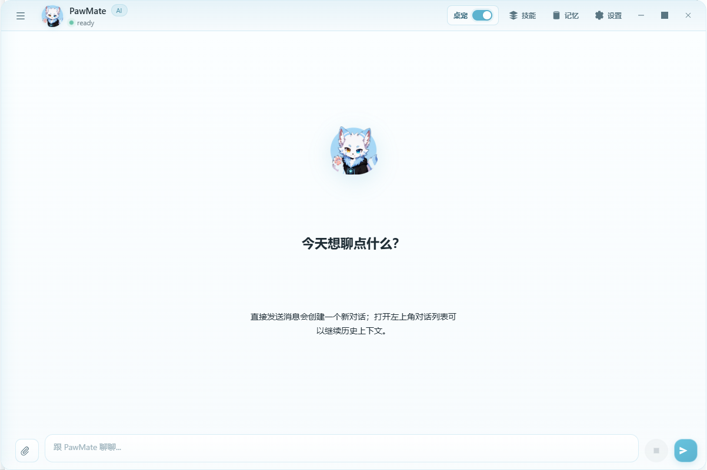
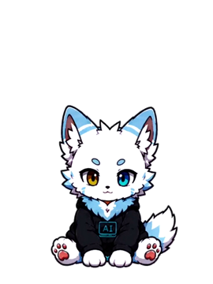
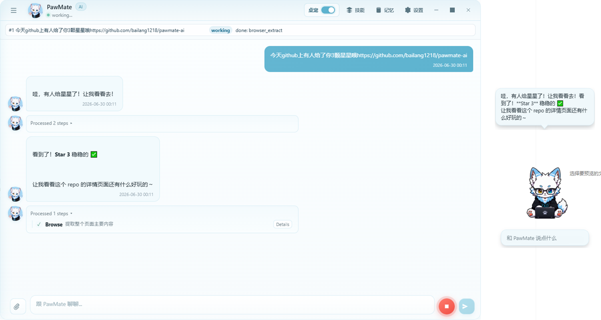
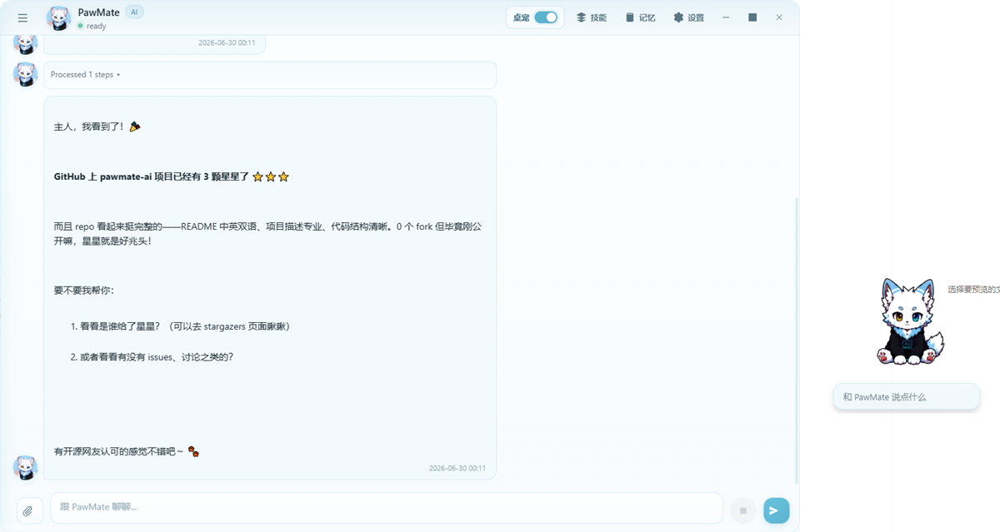
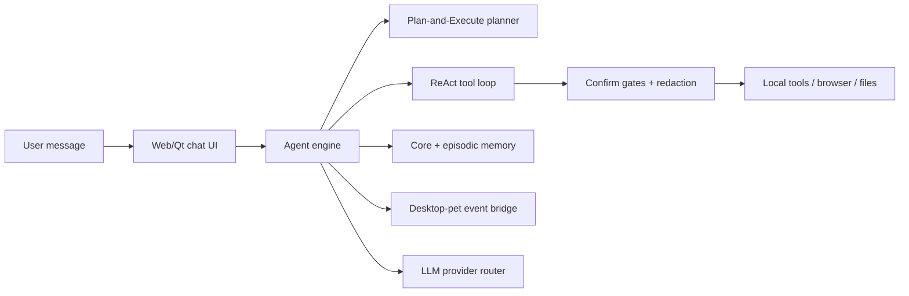

# PawMate AI

> 中文 / English


PawMate AI 是一个带桌宠形态的 Windows 本地 AI Agent。它不只是聊天窗口，而是把自研 ReAct + Plan-and-Execute 运行时、多供应商 LLM 路由、本地工具、浏览器自动化、长期记忆和动画桌宠放进同一个 PySide6 桌面应用里。

PawMate AI is a Windows desktop AI agent with an animated desktop-pet interface. It combines a hand-built ReAct + Plan-and-Execute runtime, multi-provider LLM routing, local tools, browser automation, long-term memory, and a Web/Qt chat UI in one PySide6 application.



<p align="center">
  
</p>

<p align="center">
  <sub>当前公开版使用 PNG 帧贴图；后续视觉贴图层计划迁移到 Live2D。 / The current public build uses PNG frame sprites; the visual layer is planned to migrate to Live2D later.</sub>
</p>

This repository is a sanitized public alpha package for portfolio review and reproducible local runs. It excludes private configuration, logs, browser profiles, conversation history, API keys, and other local runtime data.

这是一个脱敏后的公开 Alpha 包，用于作品集展示和可复现的本地运行。仓库不包含私有配置、日志、浏览器配置、聊天记录、API keys 或其他本地运行数据。

## 使用截图 / Screenshots

<p align="center">
  
</p>

<p align="center">
  <sub>桌宠气泡和聊天窗口会一起反馈工具执行状态。 / The desktop-pet bubble and chat window surface tool progress together.</sub>
</p>

<p align="center">
  
</p>

<p align="center">
  <sub>浏览器读取完成后，Agent 回到聊天窗口总结结果。 / After browser extraction, the agent returns a concise result summary in chat.</sub>
</p>

## 亮点 / Highlights

PawMate 不是又一个 LLM 聊天壳。它的核心目标是把“陪伴型桌宠”和“能真正干活的本地 Agent”合在一起。

PawMate is not just another LLM chat wrapper. It is built around the idea of combining a companion-style desktop pet with a local agent that can actually execute work.

- 自研 Agent 运行时：ReAct 工具循环和 Plan-and-Execute 任务规划由项目内部实现，没有依赖 LangChain 或 LlamaIndex。
- Hand-built agent runtime: ReAct tool loops and Plan-and-Execute task planning are implemented inside this project, without LangChain or LlamaIndex dependencies.
- 多供应商模型路由：支持 OpenAI-compatible、Anthropic、DeepSeek、Qwen、Gemini 和 MiniMax 风格供应商，并提供失败回退链。
- Multi-provider LLM routing: supports OpenAI-compatible providers, Anthropic, DeepSeek, Qwen, Gemini, and MiniMax-style providers, with fallback handling.
- 分级安全门：文件、命令、浏览器和工具操作通过确认级别、脱敏和沙箱设置控制。
- Layered safety gates: file, command, browser, and tool operations are controlled by confirmation levels, redaction, and sandbox settings.
- 浏览器自动化：支持 Playwright 管理浏览器，也支持通过 CDP 复用本机 Edge/Chrome 登录态。
- Browser automation: supports managed Playwright browsers and CDP-based reuse of local Edge/Chrome login-state sessions.
- 双层记忆：核心记忆和情景记忆共同支持跨会话状态保留。
- Two-layer memory: core memory and episodic memory preserve useful state across conversations.
- 桌宠运行时：桌宠动作和聊天、工具、记忆事件相连，而不是单独播放动画。
- Desktop-pet runtime: pet motion is connected to chat, tool, and memory events instead of being a detached animation loop.

## 状态 / Status

- Alpha 阶段，当前以 Windows 为主要目标平台。
- Alpha quality, currently Windows-first.
- 桌宠模块和 PNG 帧资源已包含在仓库中，避免 clone 后动画引用缺失。
- Desktop pet runtime and PNG frame assets are included so the app can run without broken animation references.
- 用户需要自行配置模型供应商 API key。
- Users must provide their own model provider API key.
- 一键 Windows 安装包/EXE 是计划项，但还不是这个公开包的一部分。
- One-click Windows installer/EXE packaging is planned, but not included in this public package yet.

## 架构 / Architecture



```text
pawmate/
  main.py                 Application bootstrap and runtime wiring
  app/                    Window and service wiring
  bridge/                 Qt/Web bridge contracts and websocket bridge
  core/                   Agent engine, LLM routing, tools, prompts, security
  tools/                  Built-in tools, browser adapters, MCP bridge
  memory/                 Memory stores and summarization helpers
  storage/                Local config, history, and conversation stores
  ui/                     PySide6 shell and Web UI assets
  desktop_pet/            Pet runtime, motion graph, loop configs, PNG assets
  skills/                 Built-in skill templates and import/install support
tests/                    Logic and routing tests
```

## 快速开始 / Quick Start

```powershell
git clone https://github.com/bailang1218/pawmate-ai.git
cd pawmate-ai
py -3.11 -m venv .venv
.\.venv\Scripts\Activate.ps1
python -m pip install -U pip
python -m pip install -e .[dev]
python -m pawmate
```

虚拟环境不会提交到仓库。`.venv` 通常包含本机路径、平台相关二进制文件、包缓存和本地元数据；clone 后请根据 `pyproject.toml` 用上面的命令重新创建。

The virtual environment is intentionally not committed. A `.venv` folder usually contains machine-specific paths, platform binaries, package caches, and local metadata. Recreate it from `pyproject.toml` with the commands above after cloning.

如果需要 Playwright 管理的浏览器自动化，请在安装依赖后安装 Chromium：

For managed Playwright browser automation, install Chromium after dependencies:

```powershell
python -m playwright install chromium
```

根据配置，PawMate 也可以使用本机已安装的 Edge/Chrome 流程。

Depending on configuration, PawMate can also use an installed Edge/Chrome flow.

## 配置 / Configuration

仓库包含 [pawmate/config.json.example](pawmate/config.json.example)。首次运行时，PawMate 会在本地创建 `pawmate/config.json`，该文件已被 Git 忽略。

The repository includes [pawmate/config.json.example](pawmate/config.json.example). On first run, PawMate creates `pawmate/config.json` locally. That file is ignored by Git.

你可以在设置界面配置凭据，也可以使用环境变量：

You can configure credentials in the settings UI, or use environment variables:

```powershell
$env:DEEPSEEK_API_KEY="..."
$env:OPENAI_API_KEY="..."
$env:ANTHROPIC_API_KEY="..."
$env:QWEN_API_KEY="..."
$env:GEMINI_API_KEY="..."
$env:MINIMAXI_API_KEY="..."
$env:MINIMAXI_GROUP_ID="..."
```

不要提交 API keys、tokens、日志、浏览器 profiles 或聊天记录。

Do not commit API keys, tokens, logs, browser profiles, or chat history.

## 测试 / Tests

```powershell
python -m pytest -q
```

当前公开包验证过 `72 passed`。测试主要覆盖路由、工具解析 holdback、浏览器封装、取消安全和桌宠动作逻辑。

The current public package has been verified with `72 passed`. The included tests focus on routing, parser holdback, browser facade behavior, cancellation safety, and desktop-pet motion logic.

## 安全模型 / Security Model

- 工具调用通过注册表路由，并带有确认级别。
- Tool calls are routed through a registry with confirmation levels.
- 文件和命令操作受运行时安全设置约束。
- File and command operations are constrained by runtime security settings.
- 敏感值会尽可能在日志或界面展示前脱敏。
- Sensitive values are redacted before being logged or surfaced where possible.
- WebSocket 默认关闭，启用时需要 token。
- WebSocket access is disabled by default and requires a token when enabled.
- 运行时数据不属于公开源码集合，并被 Git 忽略。
- Runtime data lives outside the public source set and is ignored by Git.

## 桌宠素材 / Desktop Pet Assets

桌宠代码和帧资源包含在仓库中，因为运行时依赖精确的帧名称和对齐方式。源码采用 Apache-2.0 许可；图片、头像、图标和其他视觉资产有单独边界，请查看 [ASSETS_LICENSE.md](ASSETS_LICENSE.md)。

The desktop pet code and frame assets are included because the runtime depends on exact frame names and alignment. Source code is licensed under Apache-2.0; images, avatars, icons, and other visual assets have separate boundaries documented in [ASSETS_LICENSE.md](ASSETS_LICENSE.md).

当前公开版保留 PNG 帧资源作为可运行基线；后续贴图和视觉表现层计划替换为 Live2D，以提升动作连续性并降低逐帧贴图维护成本。

The current public build keeps PNG frame assets as the runnable baseline. The texture and visual presentation layer is planned to move to Live2D later for smoother motion and lower frame-by-frame asset maintenance.

## 路线图 / Roadmap

- 稳定首次运行流程和供应商诊断。
- Stabilize first-run setup and provider diagnostics.
- 在公开基线验证后，将桌宠拆成独立可安装包。
- Split the desktop pet into a dedicated installable package after the public baseline is proven.
- 将当前 PNG 帧贴图升级/替换为 Live2D 视觉层。
- Replace the current PNG frame sprites with a Live2D visual layer.
- 添加 Windows 安装器/EXE 打包。
- Add Windows installer/EXE packaging.
- 提升 GUI 邻近模块的 CI 覆盖。
- Improve CI coverage for GUI-adjacent modules without requiring a display.
- 添加短演示 GIF，展示聊天、桌宠动作和浏览器自动化的完整回路。
- Add a short demo GIF showing the full loop from chat, pet motion, and browser automation.

## 许可证 / License

源码使用 Apache-2.0 许可，详见 [LICENSE](LICENSE)。

Source code is licensed under Apache-2.0. See [LICENSE](LICENSE).

桌宠图片、头像、图标和视觉资产在 [ASSETS_LICENSE.md](ASSETS_LICENSE.md) 中单独说明。

Desktop pet images, icons, and visual assets are documented separately in [ASSETS_LICENSE.md](ASSETS_LICENSE.md).
